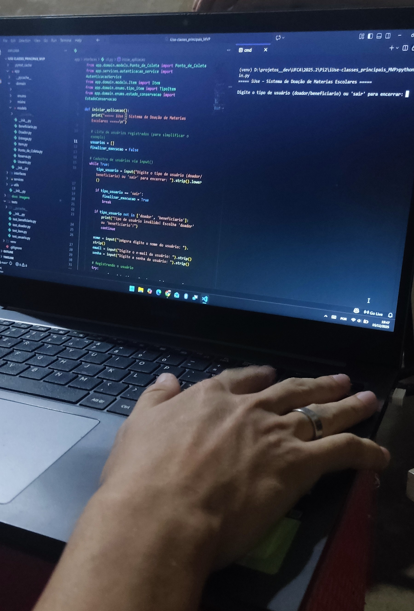
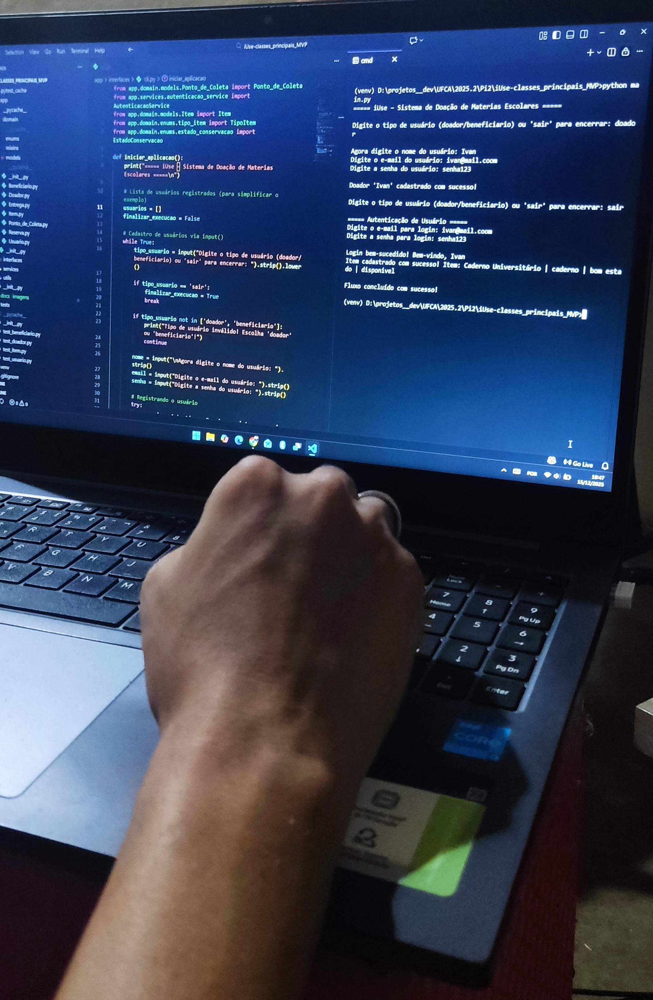
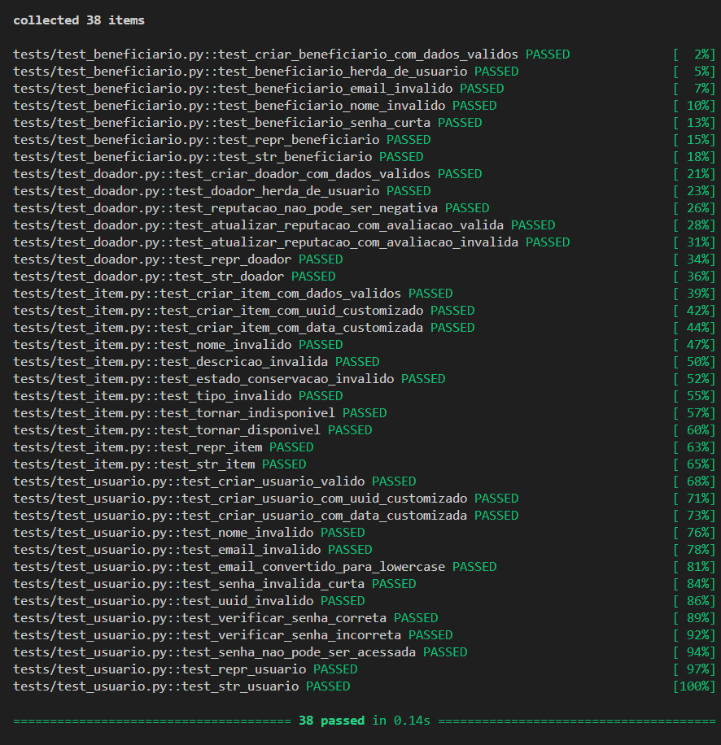
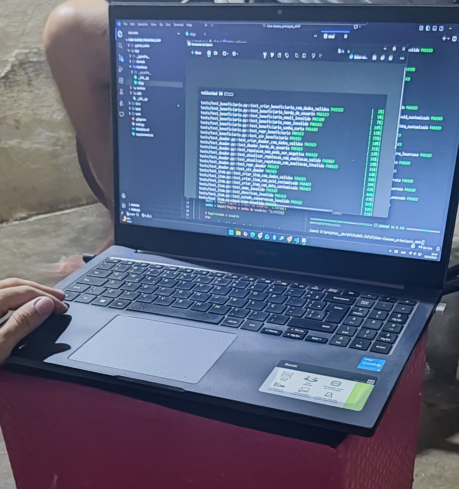

# Sistema iUse
*A educação que circula entre todos*

## Descrição do projeto
O iUse é um sistema inspirado na **Clean Architecture**, que visa organizar o código de forma modular, separando claramente o domínio da aplicação das camadas de serviço e interface. Isso melhora a legibilidade, manutenção e testabilidade.

## Estrutura do projeto
- ```app/domain```: Contém as entidades centrais e as regras de negócio.
- ```app/services```: Serviços de aplicação, como autenticação e orquestração de fluxos.
- ```app/interfaces```: Camada de interação, com foco em **CLI** e futura integração com **API/Web**.

## Ambiente de execução e dependências
Este projeto utiliza ```Python 3``` e faz uso de um ambiente virtual ```(venv)``` para garantir o isolamento das dependências e a reprodutibilidade do ambiente de desenvolvimento.

**1. Requisitos:**
- **Python 3.10+** (recomendado)
- ```pip``` (gerenciador de pacotes do Python)

**2. Criação do ambiente virtual**
Na raiz do projeto, execute:
```bash
python -m venv venv
```

Em alguns sistemas, pode ser necessário usar:
```bash
python3 -m venv venv
```

**3. Ativação do ambiente virtual**
Windows (cmd ou PowerShell)
```bash
venv\Scripts\activate
```

Linux / macOS
```bash
source venv/bin/activate
```

*Após a ativação, o terminal exibirá ```(venv)``` indicando que o ambiente está ativo.*

*Para desativar, basta digitar no terminal*
```bash
deactivate
```

**4. Instalação das dependências**
Todas as dependências do projeto estão listadas no arquivo ```requirements.txt```.
Com o ambiente virtual ativado, execute:

```bash
pip install -r requirements.txt
```

*Dependências incluídas:*
- **pytest** — framework de testes automatizados
- Outras bibliotecas necessárias ao funcionamento da aplicação

*As dependências são instaladas **exclusivamente no ambiente virtual**, não afetando o Python global do sistema.*

**5. Execução do sistema**
Com o ambiente configurado, execute:
```bash
python main.py
```

**6. Para execução dos testes**
Os testes automatizados estão localizados na pasta ```tests/``` e podem ser executados com:
```bash
pytest
```

ou mais verbosamente:

```bash
pytest -v
```

## Estrutura de pastas
```bash
iuse/
├── main.py
├── app/
│   ├── domain/
│   │   ├── models/
│   │   └── mixins/
│   ├── services/
│   ├── utils/
│   └── interfaces/
├── docs/
│   └── imagens/
└── tests/
```

## Responsabilidades por camada

- **app/domain/models**: Entidades do negócio (UML), como ```Usuario```, ```Doador```, ```Beneficiario```,  ```Item```, ```Reserva```, ```PontoColeta```, ```Entrega```, ```Retirada``` e ```Impacto```.
- **app/domain/mixins**: Comportamentos reutilizáveis, como ```AutenticavelMixin```,
- **app/services**: Regras de aplicação, incluindo **Login/Logout, orquestração de fluxos, validações entre entidades.
- **app/interfaces**: Camada de interação com usuário (**CLI** e, no futuro, ```API / Web```)

## Fluxo de execução
O ```main.py``` atua apenas como ponto de entrada da aplicação, delegando a execução para a camada de interface. Os fluxos de uso e simulações encontram-se na camada interfaces, enquanto os testes automatizados estão isolados na pasta tests, seguindo boas práticas de arquitetura.

## Imagens da execução
Aqui estão algumas imagens que ilustram a execução do código.

**Ivanildo executando classes bases:**

**1. Tipo de Usuário (Doador/Beneficiário)**
*Descrição:* Seleção do tipo de usuário para a aplicação.



**2. Usuário Preenchido**
*Descrição:* Tela mostrando o formulário de usuário preenchido.


**3. Fim da Execução**
*Descrição:* Finalização da execução do sistema, com feedback ao usuário.



**4. Testes Automatizados**
*Descrição:* Resultado da execução dos testes automatizados das classes Usuario, Doador, Beneficiario e Item.




## Time do Projeto

- **Brenna Isabelly de Oliveira** – Facilitadora
- **Cícero Danilo do Nascimento Pereira** – Responsável pela implementação de **Retirada** e **Impacto**
- **Cícero Ivanildo Borges Alves** – Responsável pelas classes **Usuário**, **Beneficiário**, **Doador** e **Item**
- **Yan Brasil Angelim de Brito** – Responsável por **Ponto de Coleta**, **Entrega** e **Reserva**